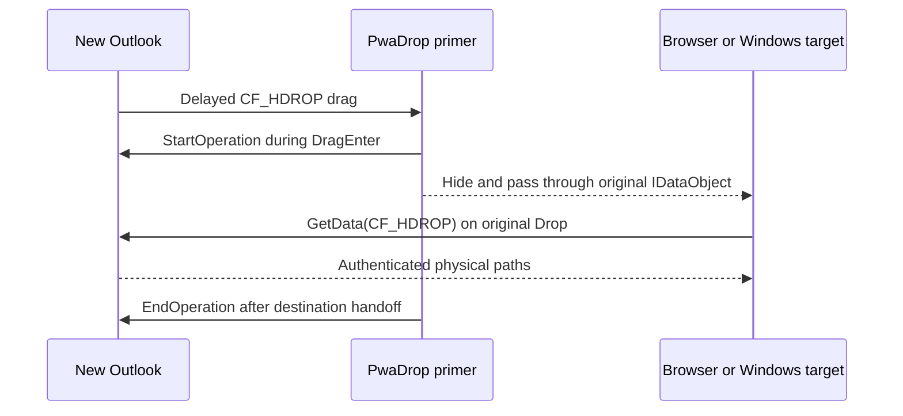

<p align="center">
  
</p>

# PwaDrop

**Drag from New Outlook. Drop anywhere.**

PwaDrop is an open-source Windows utility that turns New Outlook's asynchronous virtual files into normal file drops. It is designed for the missing workflow where an email or attachment can be dragged to File Explorer, but not directly into a browser upload target, a ServiceNow ticket, or another Windows application.

> [!IMPORTANT]
> This repository contains a cross-compiling MVP and a purpose-built Windows drag harness. Alpha 4 primes Chromium's original asynchronous data object and passes that same drag through to the destination. It still needs the complete [Windows validation matrix](docs/WINDOWS-VALIDATION.md) before it should be treated as a beta.

## MVP behavior

- Watches only drags that originate from the installed New Outlook process tree.
- Detects Chromium's asynchronous `CF_HDROP` downloads and legacy Shell virtual files (`FileGroupDescriptorW` and `FileContents`).
- Calls `IDataObjectAsyncCapability.StartOperation` before an async Chromium drag reaches its destination.
- Preserves the original mouse gesture and `IDataObject`; no second drag is synthesized for New Outlook.
- Retains safe cache-and-replay support only for legacy descriptor-based virtual files.
- Uses no Graph permissions, Outlook add-in, browser extension, mailbox login, or telemetry.
- Records only redacted payload type, timing, file count, and OLE result diagnostics under `%LOCALAPPDATA%\PwaDrop`.

## How it works



New Outlook is a WebView2-based native application. Chromium advertises download-on-drop items as `CF_HDROP`, but refuses delayed rendering until `IDataObjectAsyncCapability.StartOperation` has been called. Some destinations do not negotiate that optional interface. PwaDrop briefly becomes the drag target, starts the operation, then removes itself so the untouched original drag continues into the real destination. See the [architecture notes](docs/ARCHITECTURE.md).

## Build and run

Requirements:

- Windows 11 22H2 or newer, x64
- .NET 10 SDK
- Current Visual Studio with .NET desktop tools and the Windows 11 SDK

```powershell
.\scripts\build.ps1
dotnet run --project .\src\PwaDrop.App\PwaDrop.App.csproj
```

PwaDrop starts in the notification area. Double-click its icon to open settings. Use **Open diagnostics** from the tray menu to inspect redacted priming and legacy-relay events.

### Test without Outlook

In a second terminal:

```powershell
dotnet run --project .\tests\PwaDrop.DragHarness\PwaDrop.DragHarness.csproj
```

Drag the harness's **DRAG FROM HERE** card onto **DROP HERE**. The source refuses to provide paths until `StartOperation`, while the target knows only ordinary `FileDrop`. A successful two-file result proves PwaDrop primed the original data object and then got out of its way.

For a browser destination, open [`tests/browser-drop-target/index.html`](tests/browser-drop-target/index.html) in Edge or Chrome and drag the harness source onto its drop zone.

### Build an MSIX

```powershell
.\scripts\create-dev-certificate.ps1
.\scripts\package-msix.ps1 `
  -CertificatePath .\artifacts\PwaDrop-Development.pfx `
  -CertificatePassword pwadrop-dev
```

Development certificates and packages are ignored by git. Release packages must use a trusted code-signing certificate whose subject matches the manifest publisher.

## Privacy and compatibility

PwaDrop never calls Microsoft Graph or downloads using copied browser credentials. New Outlook remains responsible for producing the selected data through its existing authenticated drag object. Diagnostic notifications contain only HRESULT-style error codes.

The MVP supports the installed New Outlook app on Windows 11 x64. Outlook on the web, Teams, Gmail, Slack, ARM64, elevated targets, and full enterprise policy support are not yet claimed. See the [roadmap](ROADMAP.md).

## Open-source policy

PwaDrop is an independent clean-room implementation based on public Windows Shell and Chromium behavior. Do not contribute code, branding, assets, or reverse-engineered implementation details from Magic Dragin or any other commercial product.

Licensed under the [MIT License](LICENSE).
