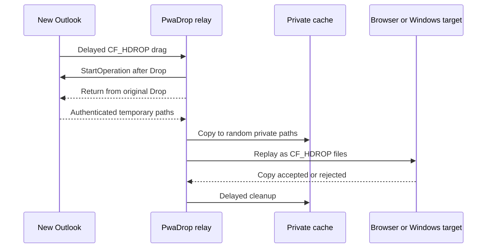

<p align="center">
  
</p>

# PwaDrop

**Drag from New Outlook. Drop anywhere.**

PwaDrop is an open-source Windows utility that turns New Outlook's asynchronous virtual files into normal file drops. It is designed for the missing workflow where an email or attachment can be dragged to File Explorer, but not directly into a browser upload target, a ServiceNow ticket, or another Windows application.

> [!IMPORTANT]
> This repository contains a cross-compiling MVP and a purpose-built Windows drag harness. Alpha 3 moves delayed Outlook materialization out of the original OLE callback and waits for that drag loop to unwind before replay. It still needs the complete [Windows validation matrix](docs/WINDOWS-VALIDATION.md) before it should be treated as a beta.

## MVP behavior

- Watches only drags that originate from the installed New Outlook process tree.
- Detects Chromium's asynchronous `CF_HDROP` downloads and legacy Shell virtual files (`FileGroupDescriptorW` and `FileContents`).
- Streams selected messages and attachments into a private per-user cache.
- Replays the drop as normal physical file paths at the original destination.
- Preserves `.eml` messages and original attachment names.
- Marks web-origin files with Mark of the Web and removes temporary sessions after a grace period.
- Uses no Graph permissions, Outlook add-in, browser extension, mailbox login, or telemetry.
- Records only redacted payload type, timing, file count, and OLE result diagnostics under `%LOCALAPPDATA%\PwaDrop`.

## How it works



New Outlook is a WebView2-based native application. Chromium advertises download-on-drop items as `CF_HDROP`, but does not materialize their temporary paths until a receiver begins an `IDataObjectAsyncCapability` operation after the drop. PwaDrop completes that operation, makes private copies, and replays stable physical paths to the destination. See the [architecture notes](docs/ARCHITECTURE.md).

## Build and run

Requirements:

- Windows 11 22H2 or newer, x64
- .NET 10 SDK
- Current Visual Studio with .NET desktop tools and the Windows 11 SDK

```powershell
.\scripts\build.ps1
dotnet run --project .\src\PwaDrop.App\PwaDrop.App.csproj
```

PwaDrop starts in the notification area. Double-click its icon to open settings. Use **Open diagnostics** from the tray menu to inspect redacted extraction timing and the final OLE replay result.

### Test without Outlook

In a second terminal:

```powershell
dotnet run --project .\tests\PwaDrop.DragHarness\PwaDrop.DragHarness.csproj
```

Drag the harness's **DRAG FROM HERE** card onto **DROP HERE**. The source refuses to provide paths until `StartOperation`, waits briefly, and then returns `CF_HDROP`; the target accepts only physical paths. A successful two-file result exercises the delayed materialization and replay path used by alpha 2.

For a browser destination, open [`tests/browser-drop-target/index.html`](tests/browser-drop-target/index.html) in Edge or Chrome and drag the harness source onto its drop zone.

### Build an MSIX

```powershell
.\scripts\create-dev-certificate.ps1
.\scripts\package-msix.ps1 `
  -CertificatePath .\artifacts\PwaDrop-Development.pfx `
  -CertificatePassword pwadrop-dev
```

Development certificates and packages are ignored by git. Release packages must use a trusted code-signing certificate whose subject matches the manifest publisher.

## Privacy and compatibility

PwaDrop never calls Microsoft Graph or downloads using copied browser credentials. New Outlook remains responsible for producing the selected data through its existing authenticated drag object. Diagnostic notifications contain only HRESULT-style error codes.

The MVP supports the installed New Outlook app on Windows 11 x64. Outlook on the web, Teams, Gmail, Slack, ARM64, elevated targets, and full enterprise policy support are not yet claimed. See the [roadmap](ROADMAP.md).

## Open-source policy

PwaDrop is an independent clean-room implementation based on public Windows Shell and Chromium behavior. Do not contribute code, branding, assets, or reverse-engineered implementation details from Magic Dragin or any other commercial product.

Licensed under the [MIT License](LICENSE).
