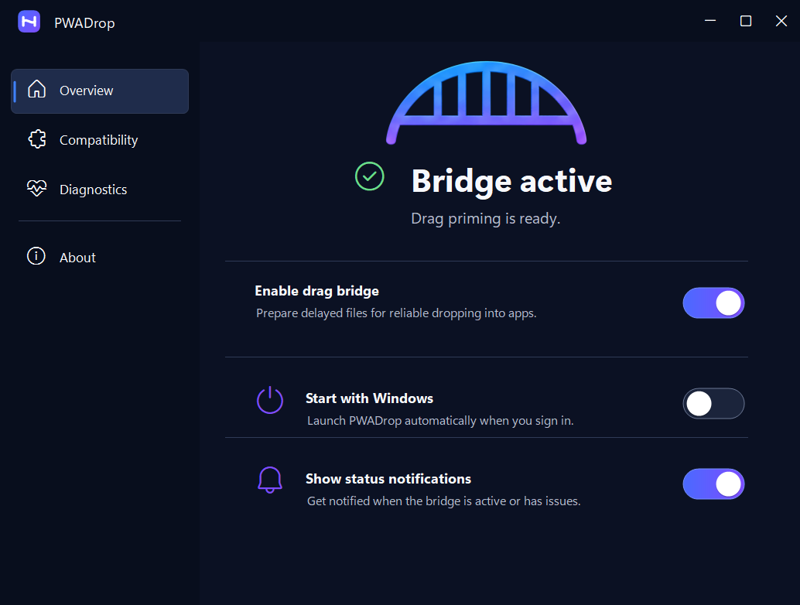
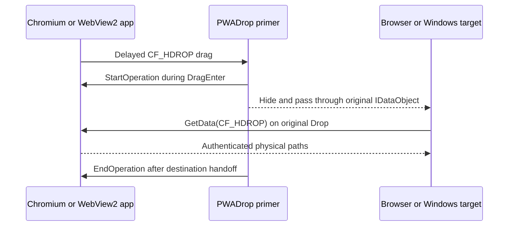

<p align="center">
  
</p>

# PWADrop

**Drag delayed files. Drop anywhere.**

PWADrop is an open-source Windows utility that turns asynchronous Chromium and WebView2 file drags into normal Windows file drops. It fills the gap where a file can be dragged from a modern app to File Explorer, but not directly into a browser upload target, a ticket, or another Windows application.



> [!IMPORTANT]
> This repository contains a cross-compiling MVP and a purpose-built Windows drag harness. Alpha 4 primes Chromium's original asynchronous data object and passes that same drag through to the destination. It still needs the complete [Windows validation matrix](docs/WINDOWS-VALIDATION.md) before it should be treated as a beta.

## MVP behavior

- Watches only drags that originate from recognized Chromium, installed PWA, or WebView2 process trees.
- Detects Chromium's asynchronous `CF_HDROP` downloads and legacy Shell virtual files (`FileGroupDescriptorW` and `FileContents`).
- Calls `IDataObjectAsyncCapability.StartOperation` before an async Chromium drag reaches its destination.
- Preserves the original mouse gesture and `IDataObject`; no second drag is synthesized for asynchronous Chromium files.
- Retains safe cache-and-replay support only for legacy descriptor-based virtual files.
- Uses no source-app add-in, browser extension, or network client.
- Records only redacted payload type, timing, file count, and OLE result diagnostics under `%LOCALAPPDATA%\PwaDrop`.

## How it works



Chromium advertises download-on-drop items as `CF_HDROP`, but can defer rendering until `IDataObjectAsyncCapability.StartOperation` has been called. Some destinations do not negotiate that optional interface. PWADrop briefly becomes the drag target, starts the operation, then removes itself so the untouched original drag continues into the real destination. See the [architecture notes](docs/ARCHITECTURE.md).

## Build and run

Requirements:

- Windows 11 22H2 or newer, x64
- .NET 10 SDK
- Current Visual Studio with .NET desktop tools and the Windows 11 SDK

```powershell
.\scripts\build.ps1
dotnet run --project .\src\PwaDrop.App\PwaDrop.App.csproj
```

PWADrop starts in the notification area. Double-click its icon to open the modern settings window. Use **Diagnostics** from the menu to inspect redacted priming and legacy-relay events.

### Test with deterministic .NET targets

In a second terminal:

```powershell
dotnet run --project .\tests\PwaDrop.DragHarness\PwaDrop.DragHarness.csproj
```

Drag the harness's **DRAG FROM HERE** card onto **DROP INTO WINFORMS**. The source refuses to provide paths until `StartOperation`, while the target knows only ordinary `FileDrop`. A successful two-file result proves PWADrop primed the original data object and then got out of its way.

To validate a second desktop .NET stack, start the WPF target and drop files from any supported source into it:

```powershell
dotnet run --project .\tests\PwaDrop.WpfDropTarget\PwaDrop.WpfDropTarget.csproj
```

For a browser destination, open [`tests/browser-drop-target/index.html`](tests/browser-drop-target/index.html) in Edge or Chrome and drag the harness source onto its drop zone.

### Build an MSIX

```powershell
.\scripts\create-dev-certificate.ps1
.\scripts\package-msix.ps1 `
  -CertificatePath .\artifacts\PwaDrop-Development.pfx `
  -CertificatePassword pwadrop-dev
```

Development certificates and packages are ignored by git. Release packages must use a trusted code-signing certificate whose subject matches the manifest publisher.

## Privacy and compatibility

PWADrop does not download files itself or copy browser credentials. The source application remains responsible for producing selected data through its existing drag object. Diagnostic notifications contain only HRESULT-style error codes.

Source detection currently includes Edge, Chrome, common Chromium browsers, installed browser PWAs, WebView2 hosts, and the deterministic test harness on Windows 11 x64. Format compatibility still depends on what each source exposes; Teams, Gmail, Slack, ARM64, elevated targets, and full enterprise policy support are not yet claimed. See the [roadmap](ROADMAP.md).

## Open-source policy

PWADrop is an independent clean-room implementation based on public Windows Shell and Chromium behavior. Do not contribute code, branding, assets, or reverse-engineered implementation details from Magic Dragin or any other commercial product.

Licensed under the [MIT License](LICENSE).
