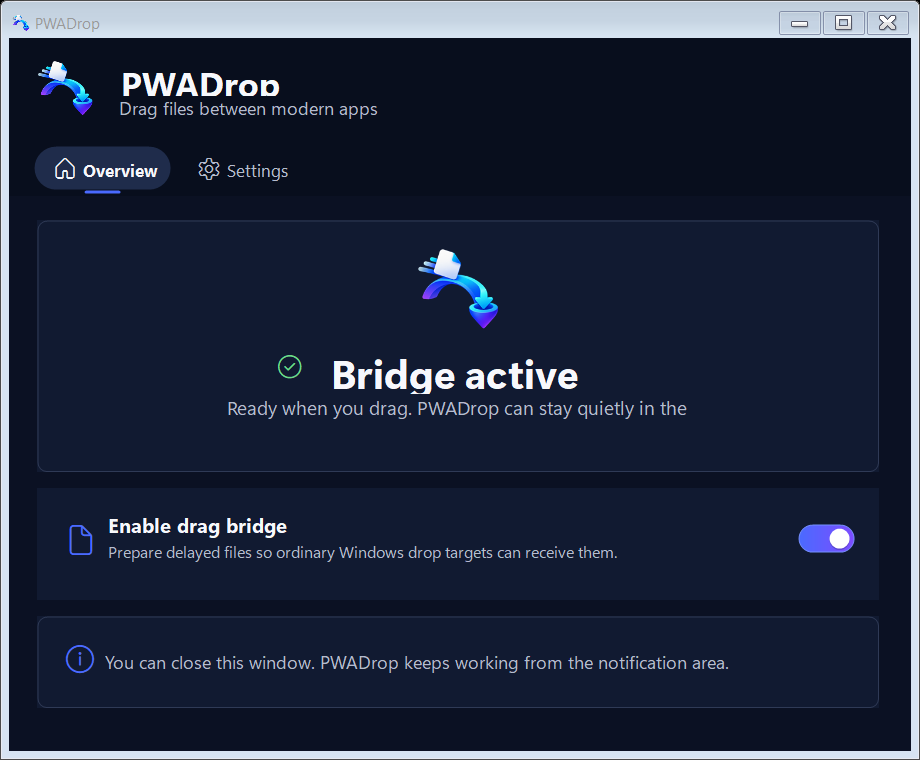
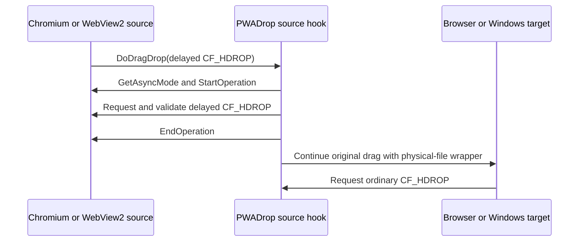

<p align="center">
  
</p>

# PWADrop

**Drag delayed files. Drop anywhere.**

PWADrop is a source-available Windows utility that turns asynchronous Chromium and WebView2 file drags into normal Windows file drops. It fills the gap where a file can be dragged from a modern app to File Explorer, but not directly into a browser upload target, a ticket, or another Windows application.



> [!IMPORTANT]
> This repository contains an experimental Windows alpha and purpose-built test probes. The implementation supports guarded Chromium-browser, WebView2, and Electron source families. Each named application still needs the complete [Windows validation matrix](docs/WINDOWS-VALIDATION.md) before it should be treated as beta-quality.

## MVP behavior

- Uses Windows top-level-window creation events, not a hot polling loop, plus one 30-second recovery reconciliation.
- Injects only into a trusted-signed, same-user, non-elevated, x64 root from an explicit Chromium, WebView2-host, or Electron source family.
- Supports Edge, Chrome, Brave, Chromium, Opera, Vivaldi, and Comet browser roots; New Outlook and New Teams WebView2 roots; and Slack, Missive, and Superhuman Electron roots.
- Replaces the `DoDragDrop` import in `msedge.dll`, `chrome.dll`, or the source executable as appropriate.
- Materializes delayed `CF_HDROP`, completes the source's async operation, and continues the original drag with a normal file-drop wrapper that hides Chromium's renderer-taint marker.
- Leaves the original source-to-destination OLE drag intact; PWADrop does not cover the desktop or synthesize a second drag.
- Uses no Outlook add-in, browser extension, authentication token, or network client.
- Records only redacted hook timing and HRESULT diagnostics under `%LOCALAPPDATA%\PwaDrop`.

## How it works


```mermaid
sequenceDiagram
    participant O as Chromium or WebView2 source
    participant H as PWADrop source hook
    participant T as Browser or Windows target

    O->>H: DoDragDrop(delayed CF_HDROP)
    H->>O: GetAsyncMode and StartOperation
    H->>O: Request and validate delayed CF_HDROP
    H->>O: EndOperation
    H->>T: Continue original drag with physical-file wrapper
    T->>H: Request ordinary CF_HDROP
```

Chromium advertises download-on-drop items as `CF_HDROP`, but can defer rendering until `IDataObjectAsyncCapability.StartOperation` has been called. Some destinations do not negotiate that optional interface. PWADrop completes that negotiation inside the recognized source process, retains Chromium's materialized file-drop handle, and lets the original drag continue with standard Windows file semantics. See the [architecture notes](docs/ARCHITECTURE.md).

## Build and run

Requirements:

- Windows 11 22H2 or newer, x64
- .NET 10 SDK
- Current Visual Studio Build Tools with .NET desktop tools, Visual C++ x64 tools, CMake, and the Windows 11 SDK

```powershell
.\scripts\build.ps1
dotnet run --project .\src\PwaDrop.App\PwaDrop.App.csproj
```

PWADrop starts in the notification area. Double-click its icon to open the settings window. Use **Diagnostics** from the menu to inspect redacted hook events.

### Test with deterministic .NET targets

In a second terminal:

```powershell
dotnet run --project .\tests\PwaDrop.DragHarness\PwaDrop.DragHarness.csproj
```

Drag the harness's **DRAG FROM HERE** card onto **DROP INTO WINFORMS**. The source refuses to provide paths until `StartOperation`, while the target knows only ordinary `FileDrop`. A successful two-file result proves the source hook primed the original OLE drag.

To validate a second desktop .NET stack, start the WPF target and drop files from any supported source into it:

```powershell
dotnet run --project .\tests\PwaDrop.WpfDropTarget\PwaDrop.WpfDropTarget.csproj
```

For a browser destination, open [`tests/browser-drop-target/index.html`](tests/browser-drop-target/index.html) in Edge or Chrome and drag the harness source onto its drop zone.

### Build an MSIX

```powershell
.\scripts\create-dev-certificate.ps1
.\scripts\package-msix.ps1 `
  -CertificatePath .\artifacts\PwaDrop-Development.pfx `
  -CertificatePassword pwadrop-dev
```

Development certificates and packages are ignored by git. Release packages must use a trusted code-signing certificate whose subject matches the manifest publisher.

## Privacy and compatibility

PWADrop does not authenticate to services or copy browser credentials. The source application remains responsible for producing selected data through its existing drag object. PWADrop injects a small native IAT hook only into explicitly recognized, trusted-signed source roots; diagnostic notifications contain only HRESULT-style error codes.

Web apps such as Outlook Web, Gmail, OneDrive, SharePoint, Teams web, Slack web, and custom sites are covered through their supported browser source. Any destination that accepts normal Windows `CF_HDROP` can work without a PWADrop plugin. ARM64, elevated sources, unknown Electron executables, and full enterprise-policy compatibility are not yet claimed. See the [roadmap](ROADMAP.md).

## Source-available license

PWADrop is an independent clean-room implementation based on public Windows Shell and Chromium behavior.

PWADrop is licensed under the [PolyForm Noncommercial License 1.0.0](LICENSE). Non-commercial use, study, modification, and redistribution are permitted under its terms. Commercial use and resale are not permitted without a separate written commercial license from the licensor.
